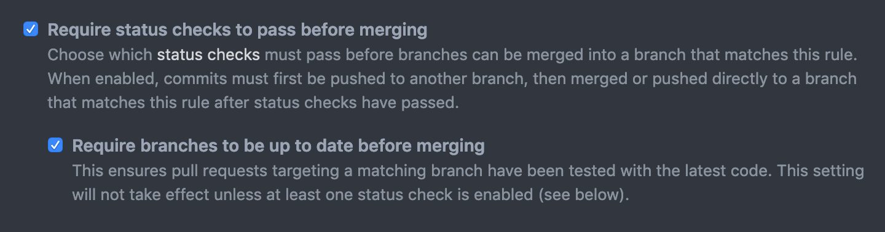

Setup
=====

:code:`env.py`
--------------

The default :code:`env.py` file that alembic will autogenerate for you includes a snippet like so:

.. code-block:: python

   def run_migrations_online():
       connectable = engine_from_config(
           config.get_section(config.config_ini_section),
           prefix="sqlalchemy.",
           poolclass=pool.NullPool,
       )

This is fine, but :code:`pytest-alembic` needs to provide alembic with a connection at runtime.
So to allow us to produce that connection in a way that :code:`env.py` understands, modify the
above snippet to resemble:

.. code-block:: python

   def run_migrations_online():
       connectable = context.config.attributes.get("connection", None)

       if connectable is None:
           connectable = engine_from_config(
               context.config.get_section(context.config.config_ini_section),
               prefix="sqlalchemy.",
               poolclass=pool.NullPool,
           )

Caplog Issues
~~~~~~~~~~~~~

The default :code:`env.py` file that alembic will autogenerate for you also includes a call to
:func:`logging.config.fileConfig`. Given that alembic tests invoke the :code:`env.py`, and
:func:`logging.config.fileConfig` has a default argument of :code:`disable_existing_loggers=True`,
this can inadvertently break tests which use pytest's :code:`caplog` fixture.

To fix this, simply provide :code:`disable_existing_loggers=False` to :code:`fileConfig`.

.. warning::
   Additionally, if you are a user of :func:`logging.basicConfig`, note that :func:`logging.basicConfig`
   "does nothing if the root logger already has handlers configured", (which is why we generally
   try to avoid :code:`basicConfig`) and may cause issues for similar reasons.

.. note::
   Python 3.8 added a :code:`force=True` keyword to :func:`logging.basicConfig`, which makes
   it somewhat less hazardous to use.

Optional but helpful additions
~~~~~~~~~~~~~~~~~~~~~~~~~~~~~~

Alembic comes with a number of other options to customize how the autogeneration of revisions
is handled, but most of them are disabled by default. There are many good reasons your particular
migrations might **not** want some of these options enabled; but if they don't apply to your
setup, we think they increase the quality of the safety this library helps to provide.

Further down in your :code:`env.py`, you'll see a configure block.

.. code-block:: python

   with connectable.connect() as connection:
       context.configure(
           connection=connection,
           target_metadata=target_metadata,
           # This is where we want to add more options!
       )

       with context.begin_transaction():
           context.run_migrations()

Consider enabling the following options:

* :code:`compare_type=True`: Indicates type comparison behavior during an autogenerate operation.
* :code:`compare_server_default=True`: Indicates server default comparison behavior during an autogenerate operation.
* :code:`include_schemas=True`: If True, autogenerate will scan across all schemas located by the SQLAlchemy get_schema_names() method, and include all differences in tables found across all those schemas. This may only be useful if you make use of schemas.

Setting up Fixtures
-------------------

We expose 2 explicitly overridable fixtures :code:`alembic_config` and :code:`alembic_engine`.

One should generally put the implementations of :ref:`alembic_config` and :ref:`alembic_engine`
in a :code:`conftest.py` (a special file recognized by pytest) at the root of your tests folder,
typically :code:`tests/conftest.py`.

If your tests are located elsewhere, you should use the :ref:`pytest config <Pytest Config>` to specify
:code:`pytest_alembic_tests_folder`, to point at your tests folder root.

Then you can define your own implementations of these fixtures

Setting up ``alembic_config``
~~~~~~~~~~~~~~~~~~~~~~~~~~~~~
:ref:`alembic_config` is the primary point of entry for configurable options for the
alembic runner. See the :ref:`API` reference for a comprehensive list. This fixture can
often be omitted though, if your use of alembic is straightforward and/or uses alembic defaults.

The default implementation is:

.. code:: python

   from pytest_alembic.config import Config

   @pytest.fixture
   def alembic_config():
       """Override this fixture to configure the exact alembic context setup required.
       """
       return Config()

See :ref:`Config` for more details about the sort of options available on our config.

Setting up ``alembic_engine``
~~~~~~~~~~~~~~~~~~~~~~~~~~~~~
:ref:`alembic_engine` is where you specify the engine with which the :ref:`alembic_runner`
should execute your tests.

The default ``alembic_engine`` implementation is:

.. code:: python

   @pytest.fixture
   def alembic_engine():
       """Override this fixture to provide pytest-alembic powered tests with a database handle.
       """
       return sqlalchemy.create_engine("sqlite:///")

If you have a **very** simple database schema, you **may** be able to get away with the default
fixture implementation, which uses an in-memory SQLite engine. In most cases however,
SQLite will not be able to sufficiently model your migrations. Typically, DDL is where features
of databases tend to differ the most, and so the **actual** database you, should likely be
what your ``alembic_engine`` is.

Pytest Mock Resources
~~~~~~~~~~~~~~~~~~~~~
Our recommended approach is to use
`pytest-mock-resources <https://pytest-mock-resources.readthedocs.io/>`_,
another library we have open sourced which uses Docker to manage the lifecycle of an ephemeral
database instance.

This library is what ``pytest-alembic`` internally uses, so it's the strategy we can most
easily guarantee should work.

If you use Postgres, MySQL, Redshift, or SQLite (or a database which reacts sufficiently closely)
``pytest-mock-resources`` can support your usecase today. For other alembic-supported databases, file an issue!

.. code-block:: python

   from pytest_mock_resources import create_postgres_fixture

   alembic_engine = create_postgres_fixture()

``alembic_engine`` Invariants
~~~~~~~~~~~~~~~~~~~~~~~~~~~~~
.. note::

   Depending on what you want, and how your code internally produces/consumes engines there is
   plenty of flexibility in how ``pytest-alembic`` test engines interact with your own.

   For example (using ``pytest-mock-resources``), you can ensure that there's no interdependence
   between this engine and the one used by your own tests:

   .. code-block:: python

      from pytest_mock_resources import create_postgres_fixture

      pg = create_postgres_fixture()
      alembic_engine = create_postgres_fixture()

      def test_foo(pg, alembic_engine):  # two unique databases
          ...

   Or if you would **prefer** them to be the same, you could instead do:

   .. code-block:: python

      import pytest
      from pytest_mock_resources import create_postgres_fixture

      pg = create_postgres_fixture()

      @pytest.fixture
      def alembic_engine(pg):
          return pg

      def test_foo(pg, alembic_engine):
          assert pg is alembic_engine  # they're literally the same
          ...

Of course, you can implement whatever strategy you want. However there are a few invariants
that an ``alembic_engine`` fixture should follow, to ensure that tests reliably pass and to avoid
inter-test state issues.

1. The engine should point to a database that must be empty. It is out of scope for pytest-alembic
   to manage the database state.

2. You should not expect to be able to roll back changes made by these tests. Alembic will internally
   perform commits, as do certain ``pytest-alembic`` features. Alembic is **literally** being
   invoked in the same way you would normally run migrations, so it's exactly as permanent.

3. The yielded engine should not be inside a (manually created) transaction. The engine is configured
   into Alembic itself, Alembic internals perform commits, and it will almost certainly not work
   if you try to manage transactional state around Alembic.

Git(hub) Settings
-----------------

We highly recommend you enable "Require branches to be up to date before merging" on repos
which have alembic migrations!

While this will require that people merging PRs to rebase on top of master before merging
(which we think is ideal for ensuring your build is always green anyways), it guarantees that
**our** tests are running against a known up-to-date migration history.

Without this option it is trivially easy to end up with an alembic version history with
2 or more heads which needs to be manually resolved.

Provider support

* Only GitLab EE supports an approximate option to GitHub's.
* Only Bitbucket EE supports an approximate option to GitHub's.
